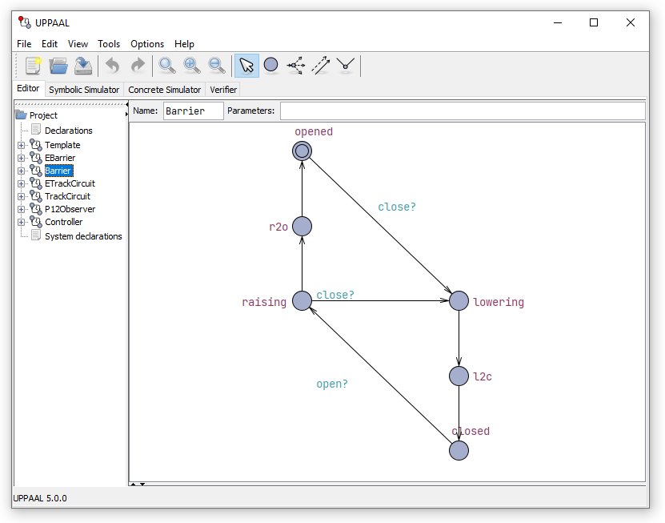
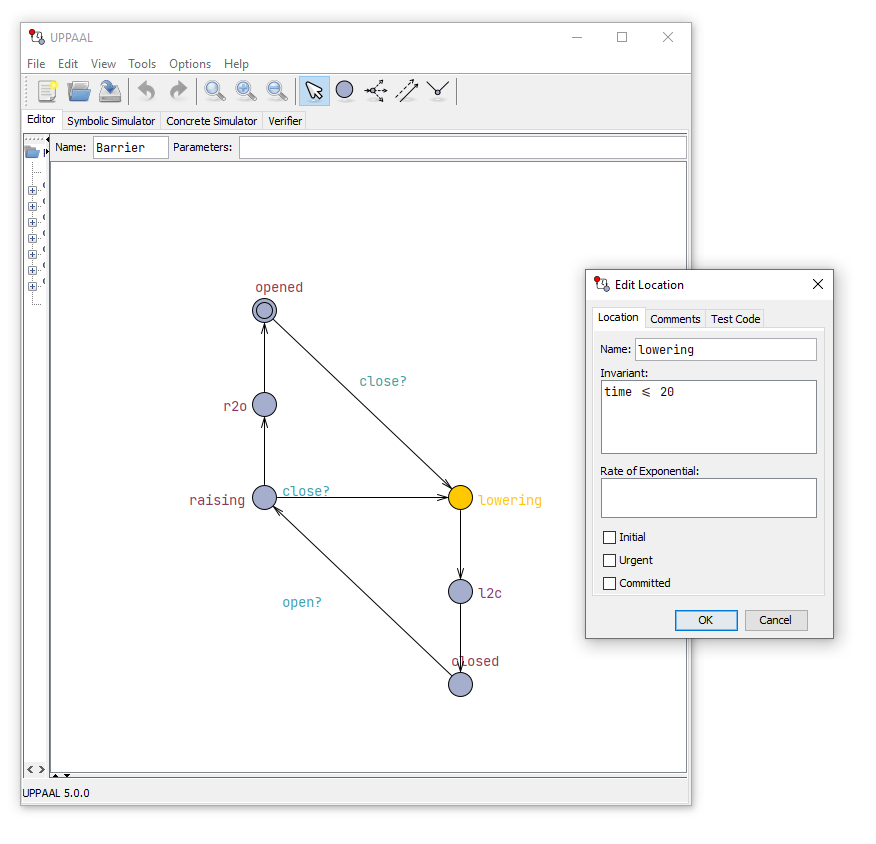
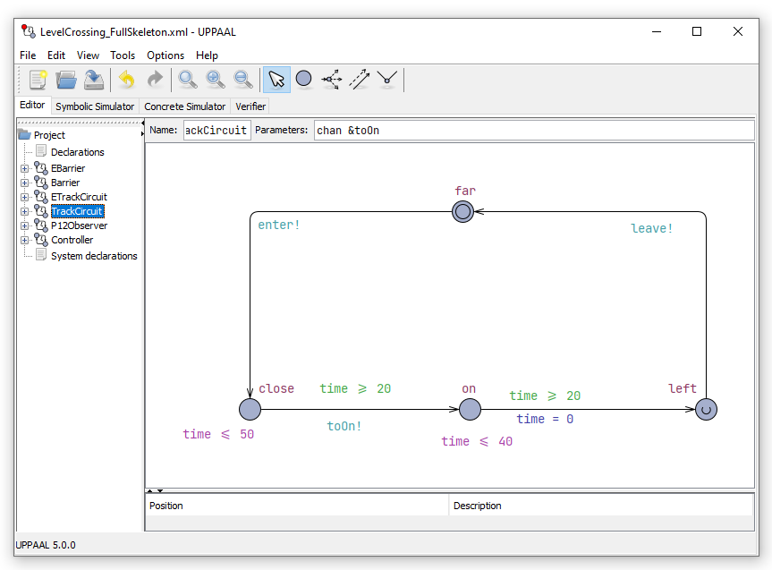

# Safety in Real-Time Systems: Modeling and Verification with Timed Automata
- Dr. Ciprian Teodorov ([ENSTA](https://teodorov.github.io/) Bretagne, France :fr:)
- Model-driven physical design for future nanoscale architectures
- Verify
    - Takes in a Specification and a System
    - Checks if they match

    | Conclusion | Witness        |
    |------------|----------------|
    | PASS       | Justification  |
    | Unknown    | Explanation    |
    | FAIL       | Counterexample |

- Throw computational resources at the problem
- Other parameters
    - Hypotheses
    - Allocation
    - Precision
    - Historical data
- Complimentary outputs
    - Intermediary results

## Timed Automata
### Syntax
- $\mathcal{A}$
- $\mathfrak{A}$
<!-- TODO -->

## UPPAAL Specifications, TCTL Properties
- Propositional logic + Temporal layer
1. `A[] p` Invariant
1. `A<> p` Eventually
1. `p --> q` p leads to q (eventually)
1. `E[] p` Potentially Always
1. `E<> p` Possibly 
- Let's do some [UPPAAL](https://github.com/teodorov/ETMF24_LevelCrossing) now

